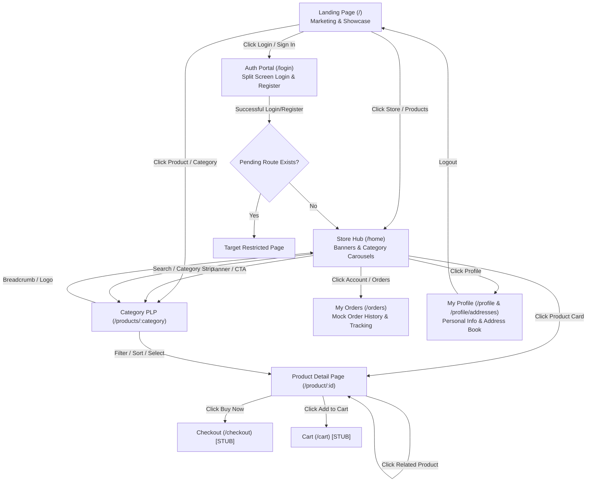

# Application Flow & User Journeys (Appflow)

## 1. Overview
This document outlines the complete navigational architecture, user journeys, interaction pathways, and system transitions for the **Enterprise Store** (Kishor Enterprises) e-commerce web platform.

---

## 2. Global Site Architecture & Navigation Map

---

## 3. Detailed User Flows

### Flow 1: Visitor Exploration & Store Entry
1. **Entry Point**: The visitor lands on `/` (Pre-login marketing landing page).
2. **Engagement Components**:
   - **Hero Carousel**: Highlights flagship sales, zero EMI offers, and top brands.
   - **Trust Elements**: 100% Genuine, 1-Year Brand Warranty, Fast Delivery.
   - **Category Showcase**: Visual grid (Mobiles, TVs, ACs, Home Theatres, Kitchen, Refrigerators).
   - **Featured Products**: Carousel of highlighted items.
   - **EMI Calculator/Partners**: Information on TVS Credit and Bajaj Finserv.
   - **Physical Store Details**: Location, opening hours, interactive WhatsApp inquiry widget.
3. **Transition Trigger**:
   - Clicking any "Shop Now" or category card takes the user to `/home` or `/products/:slug`.
   - Clicking "Sign In" opens `/login`.
   - Triggering restricted actions opens the `Login Required Modal` with redirection memory.

---

### Flow 2: Store Hub Discovery & Category Browsing (/home)
1. **Header & Context**:
   - Sticky Header dynamically adjusts shadow on scroll.
   - Top search input offers instant search suggestions.
   - Physical store badge displays delivery ETA and address quick-reference.
2. **Category Strip**:
   - Sits directly beneath the header with sticky synchronization.
   - Active state synchronizes with scroll position as the user scrolls past respective product sections.
3. **Content Sections**:
   - Hero Slider (auto-advancing promotional banners).
   - Horizontal carousels (Trending Deals, Mobiles, TVs, ACs, Home Theatres, Kitchen Appliances, Refrigerators).
   - Brand directory grid (Samsung, Apple, LG, Sony, Whirlpool, OnePlus, Daikin, Philips).
   - Footer with store contact details, map links, and customer service.

---

### Flow 3: Product Listing & Filtering (/products, /products/:category)
1. **Route Resolution**:
   - `/products` (All Categories) or category-specific routes (`/products/mobiles`, `/products/tvs`, `/products/acs`, `/products/home-theatres`, `/products/kitchen`, `/products/refrigerators`).
2. **Interaction Flow**:
   - **Sidebar / Bottom Sheet Filters**:
     - Brand checkboxes (multi-select).
     - Price range sliders/inputs (Min / Max).
     - Customer rating filter (4★ & above, 3★ & above).
     - In-Stock toggle.
   - **Toolbar Controls**:
     - Sort dropdown: Price: Low to High, Price: High to Low, Rating, Newest, Discount.
     - View mode toggle: Grid vs. List view.
     - Product count display (e.g., "Showing 24 products").
   - **Pagination**: 8 products per page with active page indicators.
   - **Product Cards**: Click card image/title to navigate to `/product/:id`.

---

### Flow 4: Product Detail Page (PDP) & Purchasing Intent (/product/:id)
1. **Page Composition**:
   - Dynamic product resolution from product catalog.
   - High-resolution gallery with thumbnail switcher.
   - Variant selection (Storage: 128GB, 256GB, 512GB; RAM; Color selection with interactive color chips).
   - Pricing display: Sale price, original price, discount percentage, total savings.
   - EMI calculation summary (e.g., "No cost EMI from ₹9,999/mo").
   - Highlights bullet list and collapsible technical specifications table.
   - Delivery checker (Pincode input with estimated delivery date).
   - Sticky action bar (Mobile/Desktop) with "Add to Cart" and "Buy Now".
   - Related products carousel.
2. **Action Flows**:
   - **Click "Buy Now"**: Checks authentication status. If authenticated, navigates to `/checkout` (currently stub). If unauthenticated, displays Login Modal, preserves destination `/checkout` in `localStorage.pendingRoute`.
   - **Click "Add to Cart"**: Navigates to `/cart` (currently stub).
   - **Click "Know Eligibility"**: Direct call link (`tel:9963657799`) or WhatsApp widget.

---

### Flow 5: Authentication & Authorization Flow (/login, /register, /logout)
1. **Accessing Auth**: Direct navigation to `/login` or redirection triggered by protected features.
2. **Form Interaction**:
   - Tab switcher for smooth toggling between **Login** and **Register** forms without page reloads.
   - Real-time client-side input validation on blur and input (email pattern, 10-digit phone, password length >= 8, password match).
3. **Submission**:
   - **Login**: `POST /login` with `{ email, password }`. Backend sets HTTP-only `authToken` cookie and returns `{ success: true, data: { safeuser } }`.
   - **Register**: `POST /register` with `{ username, email, phone_number, password, confirmPassword }`. Backend creates user, sets HTTP-only `authToken` cookie, returns safe user data.
4. **Post-Auth Redirection**:
   - Reads `localStorage.getItem('pendingRoute')`.
   - If present and valid (starts with `/`), clears `pendingRoute` and redirects to that route.
   - Otherwise, redirects to `/home`.
5. **Logout**:
   - `POST /logout` clears `authToken` cookie.
   - Client clears `localStorage.authUser` and `localStorage.pendingRoute`, redirects to `/`.

---

### Flow 6: User Account & Profile Management (/profile, /profile/addresses)
1. **Profile Hydration**:
   - On load, `frontend/assets/js/profile.js` makes `GET /api/profile` (cookie-authenticated).
   - Populates user name, email, phone number, and gender in the profile view.
   - If response is 401 Unauthorized, automatically redirects to `/login` with `pendingRoute=/profile`.
2. **Personal Info Update**:
   - User clicks "Edit", changes username, clicks "Save Changes".
   - Sends `POST /api/profile` with `{ username }`.
   - On success, updates UI and `localStorage.authUser`.
3. **Address Book Flow**:
   - Tab switcher loads "Manage Addresses" tab (`/profile/addresses`).
   - Fetches saved addresses from `GET /api/profile/addresses`.
   - **Add Address**:
     - User clicks "+ Add A New Address" or triggers "Use Current Location" (HTML5 Geolocation API reverse geocoding).
     - Fills in Full Name, 10-digit Phone, Pincode, Locality, Address Lines 1 & 2, City, State, Landmark, Default checkbox.
     - Submits to `POST /api/profile/address`.
     - Appends new address to UI list.
   - **Edit / Delete / Set Default**:
     - Currently handled on client state with local fallback pending backend endpoint completion.

---

### Flow 7: Orders & Order Tracking (/orders)
1. **Orders Dashboard**:
   - Displays user purchase history.
   - Filter chips: All, Processing, Confirmed, Out for Delivery, Delivered, Cancelled.
   - Search bar filtering orders by order number or product name.
2. **Order Detail Drawer**:
   - Clicking an order card opens a sliding side drawer.
   - Shows comprehensive breakdown: Order ID, order date, status badge, delivery address, payment method (COD, Card, EMI), price breakdown (item total, delivery, discount, total).
   - Visual vertical progress timeline: Placed → Processing → Shipped → Out for Delivery → Delivered.

---

## 4. Current State vs. Stub Workflows

| Flow / Page | Route | Current Implementation State | Next Milestone Required |
|---|---|---|---|
| Landing Page | `/` | Fully Implemented (EJS + CSS + JS) | React / Next.js migration |
| Store Hub | `/home` | Fully Implemented (EJS + CSS + JS) | Dynamic API catalog integration |
| Category PLP | `/products/:slug` | Implemented with static data | Backend database query filtering |
| Product PDP | `/product/:id` | Implemented with static catalog | Inventory management & dynamic reviews |
| Auth (Login/Register) | `/login` | Fully Implemented (Backend DB + JWT) | Password reset (OTP) & OAuth |
| Profile | `/profile` | Implemented (Backend DB + JWT) | Phone/gender update & profile photo |
| Address Book | `/profile/addresses` | Partial (Create & List API built; Edit/Delete local) | Full CRUD API integration |
| Order History | `/orders` | Frontend UI complete (Mock data) | Order DB models & checkout conversion |
| Shopping Cart | `/cart` | **Stub Page** | Cart database/session persistence |
| Checkout & Payment | `/checkout` | **Stub Page** | Payment gateway (Razorpay/Stripe) + Order placement |
| Password Recovery | `/forgot-password`, `/otp`, `/reset-password` | **Stub Page** | Email/SMS OTP service integration |
