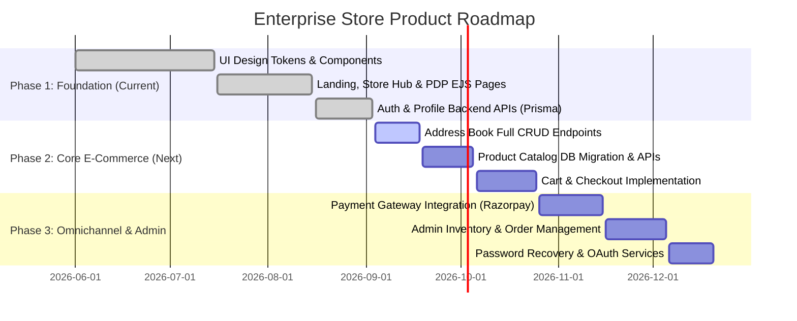

# Product Requirements Document (PRD)

## 1. Product Overview & Vision
**Product Name**: Enterprise Store (Kishor Enterprises Online Portal)  
**Vision**: Create a fast, intuitive, and conversion-optimized omnichannel e-commerce platform that connects online shoppers with physical electronics retail advantages—offering guaranteed genuine products, zero-percent financing options (TVS Credit, Bajaj Finserv), official warranties, and convenient local store pickup in Hyderabad.

---

## 2. Target Audience & User Personas

1. **Tech Enthusiast / Flagship Buyer ("Aditya")**:
   - Searches for latest smartphone/OLED specs, camera capabilities, and official warranty.
   - Demands detailed specifications, color swatches, high-res galleries, and instant comparison.
2. **Value-Conscious Family Buyer ("Sunita")**:
   - Shops for home appliances (Smart TVs, Inverter ACs, Double Door Refrigerators).
   - Highly motivated by 0% EMI schemes, festival discounts, and trusted brand warranty.
3. **Local Store Shopper ("Ramesh")**:
   - Prefers local store reliability in Hyderabad, wants to verify stock online and pickup or consult via WhatsApp before paying.

---

## 3. Core Product Goals & Success Metrics

| Goal | Description | Key Performance Indicator (KPI) |
|---|---|---|
| **Seamless Discovery** | Fast, frictionless category browsing and instant search suggestions | < 1.5s page load time, > 65% search interaction rate |
| **High Purchase Conversion** | Clear pricing breakdown, EMI calculator, and prominent CTAs | Add-to-cart rate > 12%, Checkout completion > 4% |
| **Zero-Friction Authentication** | Quick login/register split-panel with session retention | Auth completion time < 30s, Dropoff < 5% |
| **Omnichannel Integration** | Direct WhatsApp chat, store location mapping, and local pickup info | WhatsApp inquiry conversion > 8% |

---

## 4. Functional Requirements

### 4.1. Guest Experience & Storefront
- **FR-1.1 Marketing Landing Page (`/`)**:
  - Hero slider showcasing seasonal offers, trust indicators, category grid, top picks carousel, and store details.
- **FR-1.2 Store Shopping Hub (`/home`)**:
  - Sticky search header with auto-suggest, dynamic category navigation strip, multi-row category carousels with horizontal drag-scroll.
- **FR-1.3 Physical Store Connection**:
  - WhatsApp direct inquiry integration with pre-filled product details.
  - Interactive store locator showing address, map link, opening hours, and phone support.

### 4.2. Product Discovery & Navigation
- **FR-2.1 Category Product Listing (`/products`, `/products/:category`)**:
  - Filter by Brand, Price Range (Min/Max inputs), Customer Rating (3★, 4★), and In-Stock status.
  - Sort by Price: Low to High, Price: High to Low, Rating, Newest, Discount.
  - Pagination (8 items per page) and responsive list/grid view switching.
- **FR-2.2 Instant Search**:
  - Search input with live suggestion popover filtering products by keywords.

### 4.3. Product Details Page (PDP - `/product/:id`)
- **FR-3.1 Media Gallery**: Primary product image viewer with responsive thumbnail selector and color-coordinated previews.
- **FR-3.2 Variant & Color Selection**: Interactive buttons for Storage (128GB, 256GB, 512GB), RAM, and color swatches.
- **FR-3.3 Pricing & EMI Computation**:
  - Display MRP (strikethrough), Sale Price, Discount percentage, and Total Savings amount.
  - 0% EMI financing calculator showing monthly cost and partner logos (TVS Credit, Bajaj Finserv).
- **FR-3.4 Specifications & Delivery**:
  - Collapsible specification accordions grouped by General, Display, Performance, Camera, Battery, Dimensions, Warranty.
  - Pincode check tool displaying delivery ETA and local store pickup availability.
- **FR-3.5 Related Products Carousel**: Display similar items from the same category.

### 4.4. Shopping Cart & Checkout (Stub / Planned)
- **FR-4.1 Cart Management (`/cart`)**:
  - View items, adjust quantities, remove items, apply coupon codes, display subtotal, tax, and delivery fee.
- **FR-4.2 Checkout Workflow (`/checkout`)**:
  - Step 1: Delivery Address selection (pre-populated from Address Book).
  - Step 2: Payment Method (UPI, Credit/Debit Card, Net Banking, EMI, Cash on Delivery).
  - Step 3: Order Review & Confirmation.

### 4.5. Orders & Post-Purchase Tracking (`/orders`)
- **FR-5.1 Order History Dashboard**:
  - Filter orders by status: All, Processing, Confirmed, Out for Delivery, Delivered, Cancelled.
  - Search order records by Order ID or product title.
- **FR-5.2 Detailed Order Drawer**:
  - Slide-in side panel displaying order item details, shipping address, payment method, pricing breakdown, and a 5-step visual tracking timeline.

### 4.6. Authentication & User Management
- **FR-6.1 Split-Screen Auth Portal (`/login`)**:
  - Unified Login & Register interface with animated tab switcher.
  - Client-side live validation and backend credential verification.
  - Secure HTTP-only cookie session management (`authToken`).
  - Route memory redirection (`pendingRoute`) after successful authentication.
- **FR-6.2 User Profile & Address Book (`/profile`)**:
  - View and update username, phone number, email, and gender.
  - Full address book management: add, edit, delete, set default delivery address.
  - Integration with HTML5 Geolocation API for automatic location autofill.

---

## 5. Non-Functional Requirements

### 5.1. Performance
- Server-side response time < 150ms for dynamic routes.
- First Contentful Paint (FCP) < 1.0s; Largest Contentful Paint (LCP) < 2.2s on 4G networks.
- Deferred JavaScript loading for zero-render-blocking execution.

### 5.2. Security & Compliance
- Passwords hashed using bcrypt with salt factor 10.
- JWT tokens signed with secure secret, stored in HTTP-only, `SameSite=Strict` cookies (with `Secure` in production).
- SQL Injection prevention via Prisma ORM parameterized queries.
- XSS prevention through EJS output escaping.

### 5.3. Reliability & Availability
- Database connection pooling with automatic reconnection.
- Graceful API error handling returning structured JSON with HTTP 503 during database outages.
- Client-side fallback to LocalStorage if network requests fail during offline/low-connectivity conditions.

### 5.4. Responsive Design & Accessibility
- Fully responsive across screen resolutions from 320px (mobile) to 2560px (4K monitors).
- WCAG 2.1 Level AA compliance across color contrast, keyboard focus traps, and screen reader labels.

---

## 6. Phased Delivery Roadmap

