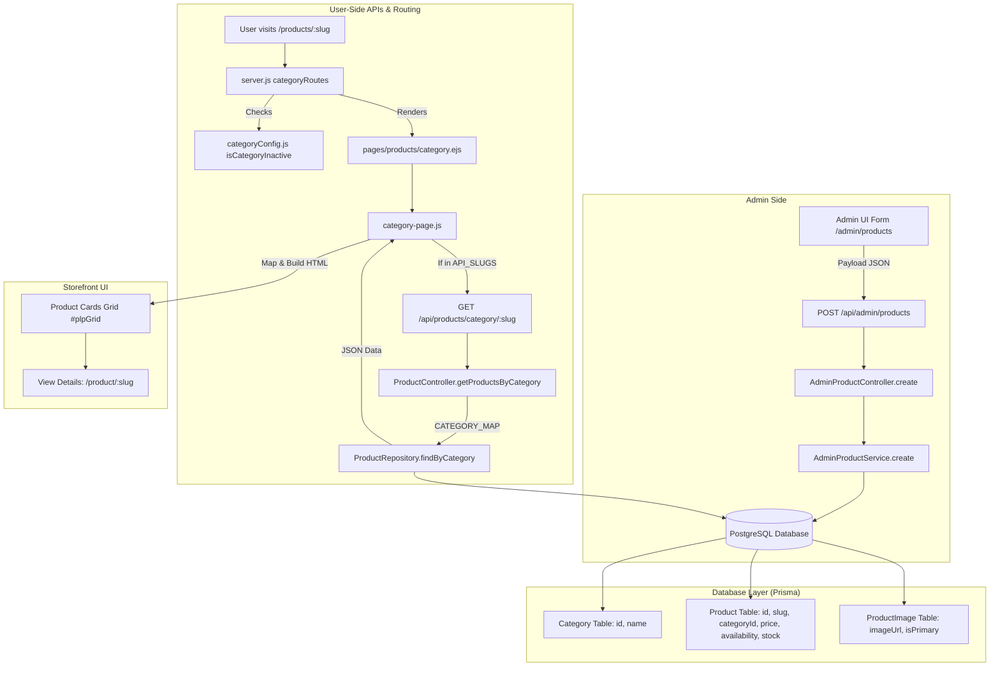

# Product Admin-to-User Lifecycle & Category Rendering Documentation

This document explains the **complete end-to-end flow** of how products created or edited in the **Admin Panel** are stored in the database, fetched by backend APIs, and rendered on the **Customer Storefront** in specific categories.

---

## Table of Contents
1. [Executive Summary & High-Level Architecture](#1-executive-summary--high-level-architecture)
2. [Admin Product Creation Workflow](#2-admin-product-creation-workflow)
3. [The Role of Slugs vs. Category Relations](#3-the-role-of-slugs-vs-category-relations)
4. [User-Side Category Page Request Flow](#4-user-side-category-page-request-flow)
5. [The "Between" Factors: All Intermediary Layers](#5-the-between-factors-all-intermediary-layers)
6. [Why Home Theatres Shows Raw/Static Data (Current State)](#6-why-home-theatres-shows-rawstatic-data-current-state)
7. [Step-by-Step Guide to Enable Live Admin-Added Home Theatres](#7-step-by-step-guide-to-enable-live-admin-added-home-theatres)
8. [Product Detail Page (PDP) & Interaction Tracking](#8-product-detail-page-pdp--interaction-tracking)
9. [Summary Checklist & Testing Guide](#9-summary-checklist--testing-guide)

---

## 1. Executive Summary & High-Level Architecture

The product pipeline connects 4 distinct subsystems:



---

## 2. Admin Product Creation Workflow

When an administrator adds or edits a product in `/admin/products`:

### A. Modal Form Inputs ([admin-modals.ejs](file:///c:/Users/HP/Desktop/SHOP/Enterprise_Website/frontend/views/partials/admin/admin-modals.ejs#L123-L242))
- **Product Name**: `name` (e.g. `"boAt Aavante Bar 3200D Soundbar"`)
- **Brand**: `brand` (e.g. `"boAt"`)
- **Category Dropdown**: `category` (Options: `Mobiles`, `TVs`, `Air Conditioners`, `Refrigerators`, `Home Theatres`, `Kitchen Appliances`)
- **Price (₹)**: `price` (e.g. `9999`)
- **Initial Stock Qty**: `stock` (e.g. `10`)
- **URL Slug**: `slug` (e.g. `"boat-aavante-bar-3200d"`)
- **Availability**: `availability` (`AVAILABLE` or `NOT_AVAILABLE`)
- **Images Gallery**: Local file uploads or image URLs (first image flagged as `isPrimary: true`)
- **Description**: `description`

### B. Client-Side Dispatch ([admin.js](file:///c:/Users/HP/Desktop/SHOP/Enterprise_Website/frontend/assets/js/admin.js#L1432-L1483))
The frontend reads all modal inputs and sends an HTTP POST:
```http
POST /api/admin/products
Content-Type: application/json
Authorization: Bearer <JWT> or Cookie: authToken=<JWT>

{
  "name": "boAt Aavante Bar 3200D Soundbar",
  "brand": "boAt",
  "category": "Home Theatres",
  "price": 9999,
  "stock": 10,
  "slug": "boat-aavante-bar-3200d",
  "availability": "AVAILABLE",
  "description": "boAt Aavante soundbar with subwoofer...",
  "images": [
    { "url": "https://res.cloudinary.com/.../img.jpg", "isPrimary": true }
  ]
}
```

### C. Backend Validation & DB Storage ([AdminProductService.js](file:///c:/Users/HP/Desktop/SHOP/Enterprise_Website/src/features/admin/Services/AdminProductService.js#L58-L131))
1. **Required Fields Check**: Validates `name`, `brand`, `price > 0`, `slug`, `category`.
2. **Slug Uniqueness**: Queries `prisma.product.findUnique({ where: { slug } })`. If slug exists, returns `409 Conflict`.
3. **Category Resolution**: Calls `AdminProductRepository.categoryExists(categoryIdentifier)`:
   - Resolves category by `id` or case-insensitive `name`.
4. **Prisma Insertion**:
   - Creates the `Product` row linked via `categoryId: category.id`.
   - Creates `ProductImage` rows linked via `productId: product.id`.

---

## 3. The Role of Slugs vs. Category Relations

> **Question: Does rendering in specific categories depend on the product slug mentioned by the admin, or are other things playing between?**

### The Short Answer:
**No, category placement does NOT depend on the product slug.** 
Category placement depends strictly on **Database Category Foreign Keys (`categoryId`)** and **Backend Category Name Mapping**.

Here is the exact distinction:

| Entity | Purpose | Example | Who Defines It? |
| :--- | :--- | :--- | :--- |
| **Product Slug** (`product.slug`) | **Unique URL identifier for the Product Detail Page (PDP)**. Used for clean URLs, SEO, and looking up a specific product. | `boat-aavante-bar-3200d` → `/product/boat-aavante-bar-3200d` | Set by Admin during product creation. |
| **Category Slug** (`route slug`) | **URL identifier for the category page route**. | `home-theatres`, `mobiles`, `tvs` → `/products/home-theatres` | Fixed by routing system in `server.js`. |
| **Category ID / Name** (`categoryId`, `Category.name`) | **Relational link linking the product to a specific catalog category**. | `Category.name = "Home Theatre"` | Selected in Admin Dropdown, stored in PostgreSQL. |

---

## 4. User-Side Category Page Request Flow

When a customer navigates to a category (e.g. `http://localhost:3001/products/home-theatres`):

### Step 1: Server Route Matching ([server.js](file:///c:/Users/HP/Desktop/SHOP/Enterprise_Website/server.js#L140-L165))
```javascript
const categoryRoutes = [
  { path: '/products/mobiles',        label: 'Mobiles',             slug: 'mobiles' },
  { path: '/products/tvs',            label: 'TVs',                 slug: 'tvs' },
  { path: '/products/acs',            label: 'Air Conditioners',     slug: 'acs' },
  { path: '/products/home-theatres',  label: 'Home Theatres',       slug: 'home-theatres' },
  { path: '/products/kitchen',        label: 'Kitchen Appliances',  slug: 'kitchen' },
  { path: '/products/refrigerators',  label: 'Refrigerators',       slug: 'refrigerators' },
];
```

### Step 2: Inactivity Check ([categoryConfig.js](file:///c:/Users/HP/Desktop/SHOP/Enterprise_Website/src/config/categoryConfig.js#L18-L29))
- `isCategoryInactive(slug)` checks if `slug` is listed in `INACTIVE_CATEGORIES` (`['kitchen', 'refrigerators']`).
- If inactive → redirects to `/home`.
- If active → renders `pages/products/category.ejs` passing `{ slug, activeCategory: slug, pageLabel }`.

### Step 3: View Rendering ([category.ejs](file:///c:/Users/HP/Desktop/SHOP/Enterprise_Website/frontend/views/pages/products/category.ejs#L34))
- The root element is rendered with `data-slug="<%= slug %>"` (e.g. `<body id="plpRoot" data-slug="home-theatres">`).

### Step 4: Client-Side Hydration ([category-page.js](file:///c:/Users/HP/Desktop/SHOP/Enterprise_Website/frontend/assets/js/category-page.js#L326-L405))
`category-page.js` checks if the current `SLUG` is included in `API_SLUGS`:
- **If `SLUG` is in `API_SLUGS`**: It calls `loadCategoryFromApi(apiSlug)` which requests `GET /api/products/category/:slug`.
- **If `SLUG` is NOT in `API_SLUGS`**: It falls back to `renderProducts()`, which reads static mock data from `window.categoryPlpData[SLUG]`.

### Step 5: Backend Category Query ([productController.js](file:///c:/Users/HP/Desktop/SHOP/Enterprise_Website/src/features/products/controllers/productController.js#L4-L56))
When `GET /api/products/category/:slug` is received:
1. `CATEGORY_MAP` converts the route slug to the database category name:
   ```javascript
   const CATEGORY_MAP = {
     mobiles: "Mobile",
     mobile: "Mobile",
     tvs: "TV",
     tv: "TV",
     acs: "AC",
     ac: "AC",
     "home-theatres": "Home Theatre",
     hometheatres: "Home Theatre",
     kitchen: "Kitchen Ware",
     refrigerators: "Refrigerator",
   };
   ```
2. `productRepository.findByCategory(dbCategoryName)` executes:
   ```javascript
   prisma.product.findMany({
     where: {
       category: {
         name: { equals: dbCategoryName, mode: "insensitive" }
       }
     },
     include: { productImages: true, category: true },
     orderBy: { createdAt: "asc" }
   });
   ```
3. The JSON array of products is returned to the client and rendered dynamically into `#plpGrid`.

---

## 5. The "Between" Factors: All Intermediary Layers

Here are all the components and rules that sit between the Admin creating a product and the User seeing it:

| # | Intermediary Component | File Location | Responsibility & Behavior |
| :--- | :--- | :--- | :--- |
| **1** | **Category Name Normalization** | [AdminProductRepository.js](file:///c:/Users/HP/Desktop/SHOP/Enterprise_Website/src/features/admin/repositories/AdminProductRepository.js#L193-L205) | Resolves the Admin dropdown selection to the matching DB `Category.id`. |
| **2** | **Category Route Map** | [productController.js](file:///c:/Users/HP/Desktop/SHOP/Enterprise_Website/src/features/products/controllers/productController.js#L4-L15) | Translates URL slug (e.g. `home-theatres`) to DB Category Name (`Home Theatre`). |
| **3** | **Showroom Inactivity Filter** | [categoryConfig.js](file:///c:/Users/HP/Desktop/SHOP/Enterprise_Website/src/config/categoryConfig.js#L18-L29) | Global toggle (`INACTIVE_CATEGORIES`). Hides entire categories from store routing and carousels. |
| **4** | **PLP Live API Switch** | [category-page.js](file:///c:/Users/HP/Desktop/SHOP/Enterprise_Website/frontend/assets/js/category-page.js#L326-L330) | `API_SLUGS` whitelist that controls whether a category is loaded from the live DB API or static JS mock data. |
| **5** | **Primary Image Extraction** | [category-page.js](file:///c:/Users/HP/Desktop/SHOP/Enterprise_Website/frontend/assets/js/category-page.js#L349-L352) | Finds `productImages.find(img => img.isPrimary)` to render the card thumbnail. |
| **6** | **Product Availability Status** | [category-page.js](file:///c:/Users/HP/Desktop/SHOP/Enterprise_Website/frontend/assets/js/category-page.js#L127-L132) | `availability === 'AVAILABLE'` renders "In Stock" badge; otherwise "Out of Stock". |
| **7** | **Client-Side Filters & Sorters** | [category-page.js](file:///c:/Users/HP/Desktop/SHOP/Enterprise_Website/frontend/assets/js/category-page.js#L168-L203) | Brand checkboxes, price range slider, min rating, and sorting (`price-asc`, `price-desc`, `rating`, `newest`). |

---

## 6. Why Home Theatres Shows Raw/Static Data (Current State)

You noticed that Home Theatres is displaying raw/mock data. Here is the exact reason why:

In [frontend/assets/js/category-page.js](file:///c:/Users/HP/Desktop/SHOP/Enterprise_Website/frontend/assets/js/category-page.js#L326):
```javascript
// Slugs that are served live from the backend API (PostgreSQL + Cloudinary).
const API_SLUGS = ['mobiles', 'mobile', 'tvs', 'tv', 'acs', 'ac'];
```
Notice that `'home-theatres'` is **not** present in `API_SLUGS`.

When a user visits `/products/home-theatres`:
1. `SLUG` is `'home-theatres'`.
2. `API_SLUGS.includes('home-theatres')` returns `false`.
3. It bypasses `fetch('/api/products/category/home-theatres')` and directly calls `renderProducts()`.
4. `renderProducts()` reads the static mock array from [category-plp-data.js](file:///c:/Users/HP/Desktop/SHOP/Enterprise_Website/frontend/assets/data/category-plp-data.js#L18-L27) (`window.categoryPlpData['home-theatres']`).

Therefore, even if an admin creates a Home Theatre product in the DB, it does not appear on `/products/home-theatres` because the frontend PLP script is not yet querying the API for this category slug.

---

## 7. Step-by-Step Guide to Enable Live Admin-Added Home Theatres

To switch **Home Theatres** from static raw data to live database data (so that admin additions appear immediately):

### 1. Update `API_SLUGS` in `frontend/assets/js/category-page.js`
Add `'home-theatres'` to the `API_SLUGS` array:
```diff
- const API_SLUGS = ['mobiles', 'mobile', 'tvs', 'tv', 'acs', 'ac'];
+ const API_SLUGS = ['mobiles', 'mobile', 'tvs', 'tv', 'acs', 'ac', 'home-theatres'];
```

### 2. Verify `CATEGORY_MAP` in `src/features/products/controllers/productController.js`
Ensure `"home-theatres"` maps to the exact name in your Prisma `Category` table:
```javascript
const CATEGORY_MAP = {
  ...
  "home-theatres": "Home Theatre",
  hometheatres: "Home Theatre",
};
```

### 3. Ensure the Category exists in Database
Verify that the category record exists in PostgreSQL (e.g., via `prisma.category.upsert({ where: { name: "Home Theatre" }, create: { name: "Home Theatre" } })`).

### 4. Clear static fallback data (Optional)
In `frontend/assets/data/category-plp-data.js`, you can set `'home-theatres': []` just like `mobiles`, `tvs`, and `acs`.

---

## 8. Product Detail Page (PDP) & Interaction Tracking

Once a product is rendered on the category grid, clicking "View Details" navigates to:
```
/product/:slug   (or /product/:id)
```

### PDP Lifecycle ([pdp.js](file:///c:/Users/HP/Desktop/SHOP/Enterprise_Website/frontend/assets/js/pdp.js#L521-L625)):
1. `pdp.js` extracts the slug or ID from the URL path.
2. Calls `GET /api/products/:identifier`.
3. Backend [productRepository.findByIdOrSlug](file:///c:/Users/HP/Desktop/SHOP/Enterprise_Website/src/features/products/repositories/productRepository.js#L32-L49) searches by either `id` OR `slug`.
4. Renders full gallery images, price, stock, warranty, specs, and reviews.
5. Fires a background `POST /api/products/:id/interaction` with `{ type: "PRODUCT_VIEW" }` to update the Trending Deals engine.

---

## 9. Summary Checklist & Testing Guide

When testing Admin Add-ons to verify end-to-end user-side rendering:

- [ ] **Admin Product Creation**:
  - Name, Brand, Price, Slug, and Category selected.
  - At least one image uploaded/linked.
- [ ] **Slug Verification**:
  - Slug must be lowercase and URL-friendly (e.g. `sony-ht-a9-home-theatre`).
  - Slug must be unique in DB.
- [ ] **Category Name Matching**:
  - The Category selected in the Admin form must match `Category.name` in DB and `CATEGORY_MAP` in `productController.js`.
- [ ] **Frontend Category Switch**:
  - The category slug must be listed in `API_SLUGS` in `category-page.js` to enable live fetching over static mock data.
- [ ] **Showroom Status**:
  - The category slug must not be in `INACTIVE_CATEGORIES` in `categoryConfig.js`.
