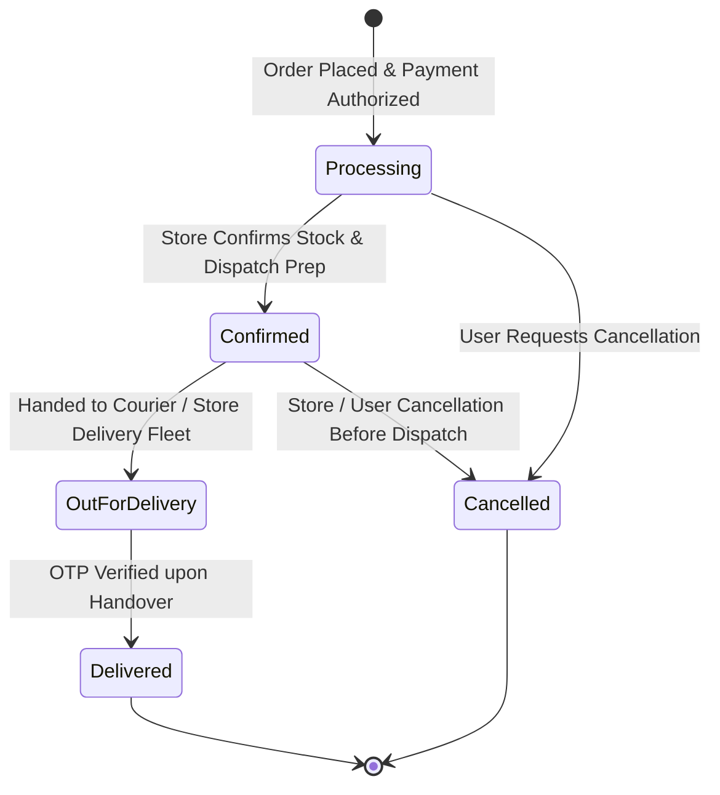

# Business Rules, Validations & Constraints (Rules)

## 1. Authentication & Security Rules

### 1.1. User Credentials & Registration
- **Username Constraint**: Must be a string with a minimum length of 3 characters (`username.length >= 3`).
- **Email Uniqueness & Format**:
  - Must conform to standard email regex: `/^[^\s@]+@[^\s@]+\.[^\s@]+$/`.
  - Stored in normalized lowercase (`email.trim().toLowerCase()`).
  - Must be unique across all records in the `User` database table. Duplicate registration attempts must return HTTP 409 Conflict.
- **Phone Number Format**:
  - Must be a valid 10-digit Indian mobile number (`/^\d{10}$/`).
  - Stored uniquely per user in the database.
- **Password Strength & Hashing**:
  - Minimum 8 characters in length (`password.length >= 8`).
  - Passwords must match on registration (`password === confirmPassword`).
  - Must be hashed with `bcrypt` using at least 10 salt rounds before database persistence.
  - Plaintext passwords must never be logged, cached, or returned in API responses.

### 1.2. Session & Token Rules
- **JWT Signing**:
  - Payload must include `{ userId, email, role }`.
  - Signed with `process.env.JWT_SECRET`.
  - Expiration Rule: Tokens must have a consistent expiration across both registration and login (Standard: `7 days`).
- **Cookie Policy**:
  - Cookie name: `authToken`.
  - `httpOnly: true` (prevents JavaScript access via XSS).
  - `sameSite: 'strict'` (mitigates CSRF vulnerabilities).
  - `secure: true` when `process.env.NODE_ENV === 'production'`.
  - `maxAge: 7 * 24 * 60 * 60 * 1000` (7 days).
  - `path: '/'`.

---

## 2. Role-Based Access Control (RBAC) & Route Permissions

| Route / Resource | Method | Access Level | Description / Constraint |
|---|---|---|---|
| `/` | `GET` | Public | Marketing landing page |
| `/home` | `GET` | Public | Store shopping hub |
| `/products/**` | `GET` | Public | Product browsing and filtering |
| `/product/:id` | `GET` | Public | Product details page |
| `/login`, `/register` | `GET`, `POST` | Public / Guest | Auth portal; redirect to `/home` if already authenticated |
| `/logout` | `POST` | Authenticated | Clears auth cookie |
| `/profile`, `/profile/addresses` | `GET` | Authenticated (USER/ADMIN) | Directs to `/login` with `pendingRoute` if unauthenticated |
| `/api/profile` | `GET`, `POST` | Authenticated (USER/ADMIN) | Requires valid `authToken` cookie |
| `/api/profile/address(es)` | `GET`, `POST` | Authenticated (USER/ADMIN) | Address owner check required |
| `/orders` | `GET` | Authenticated (USER/ADMIN) | Displays current user's purchase history |
| `/cart`, `/checkout` | `GET` | Authenticated / Guest Cart | Checkout requires user authentication |
| `/admin/**` | Any | Restricted (ADMIN only) | Planned admin dashboard and catalog management |

---

## 3. Data Integrity & Address Book Rules

### 3.1. Address Validations
- **Required Fields**:
  - `full_name`: Non-empty string (min 2 characters).
  - `phone_number`: Exactly 10 digits.
  - `postal_code`: Exactly 6 digits (Indian PIN code standard).
  - `address_line_1`: Flat, House no., Building, Street.
  - `city`: Non-empty string.
  - `state`: Non-empty string.
  - `country`: Defaults to "India".
- **Default Address Invariant**:
  - A user can have at most **one** default address (`is_default: true`) at any given time.
  - When an address is marked `is_default: true`, all other addresses belonging to that user must atomically be updated to `is_default: false`.
  - If a default address is deleted and other addresses exist, the next most recent address should automatically be promoted to default.
- **Relational Integrity**:
  - Address must belong to a valid `user_id`.
  - Deleting a `User` cascades and deletes all associated `Address` records (`onDelete: Cascade`).

---

## 4. Product, Pricing & EMI Business Rules

### 4.1. Pricing Computations
- `originalPrice` (MRP) must be greater than or equal to `salePrice` (`originalPrice >= salePrice`).
- `discountPercentage` is calculated as:
  $$\text{discount} = \text{round}\left(\frac{\text{originalPrice} - \text{salePrice}}{\text{originalPrice}} \times 100\right)$$
- `savings` is calculated as:
  $$\text{savings} = \text{originalPrice} - \text{salePrice}$$

### 4.2. 0% EMI Financing Calculation
- Available for products priced above ₹10,000.
- Monthly installment calculation:
  $$\text{Monthly EMI} = \text{ceil}\left(\frac{\text{salePrice}}{\text{Tenure (Months)}}\right)$$
- Standard tenures supported: 3, 6, 9, 12, 18, 24 months.
- Zero processing fees and 0% interest applicable through approved financing partners (TVS Credit, Bajaj Finserv).

---

## 5. Order Lifecycle & State Machine

### 5.1. Order Transition Constraints
- **Cancellation Rule**: An order can only be cancelled by the user if its state is `Processing` or `Confirmed`. Once marked `OutForDelivery` or `Delivered`, cancellation is disallowed (must proceed through Return/Exchange flow).
- **Modification Rule**: Delivery addresses cannot be modified after the order reaches `OutForDelivery`.
- **Payment Reconciliation**: COD orders require cash collection upon delivery; online payments (UPI, Card, Net Banking) must have confirmed webhook verification before transitioning to `Confirmed`.

---

## 6. System Error Handling & Resilience Rules
1. **Database Unavailability**:
   - If Prisma encounters connection timeout (`P1001`) or pool exhaustion, API routes must return HTTP 503 with `{ success: false, message: "Service temporarily unavailable. Please try again later." }`.
2. **Malformed Payloads**:
   - Malformed JSON payloads must be intercepted by Express middleware and return HTTP 400 `{ success: false, message: "Request body must be valid JSON." }` rather than leaking stack traces.
3. **Sensitive Information Sanitization**:
   - The field `password_hash` must be strictly omitted from all JSON responses using destructuring (`const { password_hash, ...safeUser } = user;`).
