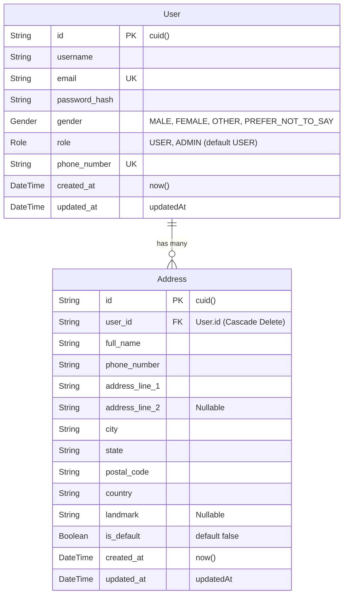
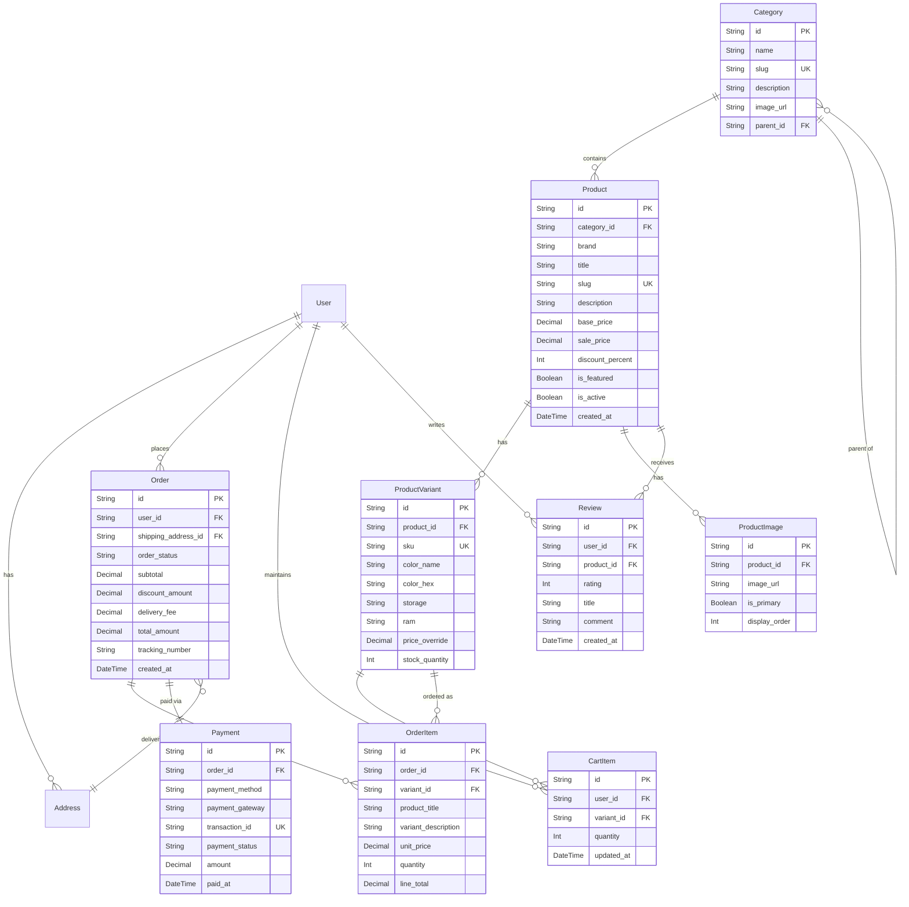

# Database Schema & Data Models (Schema)

## 1. Current Database Schema (Prisma PostgreSQL)

The current production relational database schema is managed via **Prisma ORM** connecting to **PostgreSQL**.



### 1.1. Prisma Schema Definition (`prisma/schema.prisma`)

```prisma
generator client {
  provider = "prisma-client-js"
}

datasource db {
  provider = "postgresql"
  url      = env("DATABASE_URL")
}

model User {
  id            String   @id @default(cuid())
  username      String
  email         String   @unique
  password_hash String
  gender        Gender?
  role          Role     @default(USER)
  phone_number  String   @unique
  created_at    DateTime @default(now())
  updated_at    DateTime @updatedAt

  addresses     Address[]
}

enum Gender {
  MALE
  FEMALE
  OTHER
  PREFER_NOT_TO_SAY
}

enum Role {
  USER
  ADMIN
}

model Address {
  id             String   @id @default(cuid())
  user_id        String

  full_name      String
  phone_number   String
  address_line_1 String
  address_line_2 String?
  city           String
  state          String
  postal_code    String
  country        String
  landmark       String?
  is_default     Boolean  @default(false)

  created_at     DateTime @default(now())
  updated_at     DateTime @updatedAt

  user           User     @relation(fields: [user_id], references: [id], onDelete: Cascade)

  @@index([user_id])
}
```

---

## 2. Frontend Data Models (Current JavaScript Stores)

Currently, storefront catalog items, category trees, order histories, and banners reside in client data modules (`frontend/assets/data/*.js`):

### 2.1. Product Object Structure (`product-data.js` & `category-plp-data.js`)
```javascript
{
  id: 201,                          // Unique numeric ID
  category: "mobiles",              // Category slug
  brand: "Samsung",                 // Brand name
  name: "Galaxy S24 Ultra 5G",       // Product display name
  tagline: "200MP Camera · Titanium Frame", // Short summary
  originalPrice: 134999,            // Original MRP in INR
  salePrice: 119999,                // Selling price in INR
  discount: 11,                     // Discount percentage
  rating: 4.8,                      // Average star rating (1.0 - 5.0)
  reviews: 3240,                    // Total review count
  badge: "Best Seller",             // Optional ribbon badge text
  badgeType: "sale",                // Badge color type ('sale', 'new', 'trending')
  colors: [                         // Available color variations
    { label: "Titanium Black", hex: "#1c1c1e", images: [] },
    { label: "Titanium Gray",  hex: "#8e8e93", images: [] }
  ],
  variants: [                       // Spec variants
    { group: "Storage", options: ["256GB", "512GB", "1TB"] },
    { group: "RAM",     options: ["12GB"] }
  ],
  highlights: [ "200MP Adaptive Pixel Camera", "Snapdragon 8 Gen 3" ],
  description: "The Samsung Galaxy S24 Ultra is the pinnacle...",
  specs: [                          // Categorized technical specifications
    {
      group: "Display",
      rows: [
        ["Size", "6.8 inches"],
        ["Type", "Dynamic AMOLED 2X"]
      ]
    }
  ],
  delivery: {
    date: "Tomorrow",
    note: "Order before 8 PM",
    pickup: true,
    installation: false,
    free: true
  },
  emi: {
    from: 9999,
    months: 12
  },
  relatedCategory: "mobiles"
}
```

### 2.2. Order Object Structure (`orders-data.js`)
```javascript
{
  id: "ORD-8821",
  date: "14 Aug 2026",
  status: "delivered",              // 'processing' | 'confirmed' | 'out_for_delivery' | 'delivered' | 'cancelled'
  product: {
    name: "Samsung Galaxy S24 Ultra",
    variant: "256GB · Titanium Black",
    price: 119999,
    originalPrice: 134999,
    color: "#1c1c1e"
  },
  payment: {
    method: "0% EMI (TVS Credit)",
    monthly: 9999,
    tenure: "12 months",
    status: "Paid"
  },
  shipping: {
    address: "Flat 402, Green Meadows, Madhapur, Hyderabad, TS 500081",
    deliveryDate: "16 Aug 2026",
    trackingId: "HYD-EXP-772910"
  },
  priceBreakdown: {
    itemTotal: 119999,
    delivery: 0,
    discount: 15000,
    total: 119999
  },
  timeline: [
    { step: "Order Placed",      date: "14 Aug, 10:30 AM", done: true },
    { step: "Order Confirmed",   date: "14 Aug, 11:15 AM", done: true },
    { step: "Shipped",           date: "15 Aug, 09:00 AM", done: true },
    { step: "Out for Delivery",  date: "16 Aug, 08:30 AM", done: true },
    { step: "Delivered",         date: "16 Aug, 02:45 PM", done: true }
  ]
}
```

---

## 3. Comprehensive Target E-Commerce Database Schema

To evolve from client-side mock datasets into a fully transactional e-commerce platform, the database schema must expand to include product catalogs, inventory, cart sessions, order transactions, and payments:



---

## 4. REST API Request & Response Contracts

### 4.1. `POST /register`
- **Request Body**:
  ```json
  {
    "username": "John Doe",
    "email": "john@example.com",
    "phone_number": "9876543210",
    "password": "SecurePassword123",
    "confirmPassword": "SecurePassword123"
  }
  ```
- **Response `201 Created`**:
  ```json
  {
    "success": true,
    "message": "Registered successfully",
    "data": {
      "safeuser": {
        "id": "cm1234abc",
        "username": "John Doe",
        "email": "john@example.com",
        "phone_number": "9876543210",
        "gender": null,
        "role": "USER",
        "created_at": "2026-09-03T18:00:00.000Z",
        "updated_at": "2026-09-03T18:00:00.000Z"
      }
    }
  }
  ```

### 4.2. `POST /login`
- **Request Body**:
  ```json
  {
    "email": "john@example.com",
    "password": "SecurePassword123"
  }
  ```
- **Response `200 OK`**:
  ```json
  {
    "success": true,
    "data": {
      "safeuser": {
        "id": "cm1234abc",
        "username": "John Doe",
        "email": "john@example.com",
        "phone_number": "9876543210",
        "gender": null,
        "role": "USER",
        "created_at": "2026-09-03T18:00:00.000Z",
        "updated_at": "2026-09-03T18:00:00.000Z"
      }
    }
  }
  ```

### 4.3. `GET /api/profile`
- **Headers**: Cookie `authToken=...`
- **Response `200 OK`**:
  ```json
  {
    "success": true,
    "data": {
      "id": "cm1234abc",
      "username": "John Doe",
      "email": "john@example.com",
      "phone_number": "9876543210",
      "gender": "MALE",
      "role": "USER",
      "created_at": "2026-09-03T18:00:00.000Z",
      "updated_at": "2026-09-03T18:00:00.000Z"
    }
  }
  ```

### 4.4. `POST /api/profile/address`
- **Request Body**:
  ```json
  {
    "full_name": "John Doe",
    "phone_number": "9876543210",
    "address_line_1": "Flat 301, Lakeview Apts",
    "address_line_2": "Road No 12, Banjara Hills",
    "landmark": "Near City Center Mall",
    "city": "Hyderabad",
    "state": "Telangana",
    "postal_code": "500034",
    "country": "India",
    "is_default": true
  }
  ```
- **Response `201 Created`**:
  ```json
  {
    "success": true,
    "data": {
      "id": "addr9876xyz",
      "user_id": "cm1234abc",
      "full_name": "John Doe",
      "phone_number": "9876543210",
      "address_line_1": "Flat 301, Lakeview Apts",
      "address_line_2": "Road No 12, Banjara Hills",
      "landmark": "Near City Center Mall",
      "city": "Hyderabad",
      "state": "Telangana",
      "postal_code": "500034",
      "country": "India",
      "is_default": true,
      "created_at": "2026-09-03T18:30:00.000Z",
      "updated_at": "2026-09-03T18:30:00.000Z"
    }
  }
  ```
