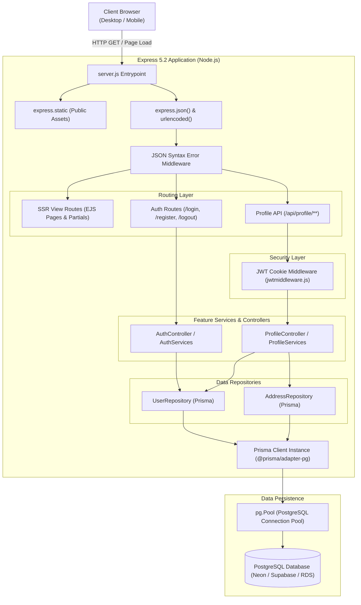
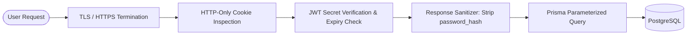

# Technical Specification & System Architecture (TechSpec)

## 1. Technical Stack Overview

| Layer | Technology | Version | Purpose |
|---|---|---|---|
| **Runtime** | Node.js (ES Modules) | `>= 18.x` | Server execution environment |
| **Web Framework** | Express.js | `^5.2.1` | HTTP routing, middleware pipeline, static serving |
| **Template Engine** | EJS (Embedded JavaScript) | `^6.0.1` | Server-side HTML rendering with reusable partials |
| **ORM / Data Layer**| Prisma Client & CLI | `^7.8.0` | Type-safe database client and schema migration tool |
| **Database Adapter**| `@prisma/adapter-pg` + `pg` | `^7.8.0` / `^8.22.0` | PostgreSQL connection pool and adapter |
| **Database** | PostgreSQL | `>= 14.x` | Relational data persistence |
| **Authentication** | `jsonwebtoken` + `bcrypt` | `^9.0.3` / `^6.0.0` | JWT signing/verification & password hashing |
| **Styling** | Vanilla CSS3 (Custom Properties) | CSS3 Standard | Token-based design system with no build step |
| **Client Scripting**| Vanilla ECMAScript (IIFE / ES6) | ES2022 | Modular DOM event handling, sliders, fetch API |
| **Configuration** | `dotenv` | `^17.4.2` | Environment variable management |

---

## 2. System Architecture & Component Diagram

---

## 3. Backend Architecture & Design Patterns

### 3.1. Layered Feature Architecture
The codebase adheres to a modular **Controller-Service-Repository** pattern partitioned by business domains (`src/features/`):
- **Controllers (`controllers/`)**: Extract HTTP request data (`req.body`, `req.user`, `req.params`), validate basic shape, invoke business services, set cookies, and format JSON responses with appropriate HTTP status codes.
- **Services (`services/`)**: Implement core domain logic, credential validation, business invariant checks (e.g., password matching, email availability), password hashing, and token signing.
- **Repositories (`repositories/`)**: Encapsulate all database interaction logic via Prisma Client, abstracting ORM queries from the business layer.

### 3.2. Middleware Execution Pipeline
1. `express.json()` and `express.urlencoded({ extended: true })` parse the payload.
2. Custom error middleware catches JSON parsing exceptions and returns HTTP 400 Bad Request.
3. Feature routers process requests. Protected routes invoke `jwtAuthenticate` to parse and verify the `authToken` cookie.
4. Catch-all `404` handler serves the custom `pages/stub` template with HTTP 404 status.

---

## 4. Security Architecture & Threat Mitigation

1. **Authentication Token Lifecycle**:
   - Token issued upon registration and login.
   - Encrypted in an `httpOnly`, `SameSite=Strict` cookie to prevent client-side JavaScript theft via XSS.
   - Decoded and validated on each protected API request by `jwtAuthenticate`.
2. **Password Security**:
   - Passwords hashed using `bcrypt` with salt rounds = 10.
   - Raw passwords never stored in memory longer than the authentication transaction.
3. **Data Sanitization**:
   - `password_hash` explicitly stripped prior to transmitting user objects over the network.
4. **SQL Injection Protection**:
   - Prisma ORM converts all query calls into parameterized SQL prepared statements, eliminating SQL injection risks.

---

## 5. Performance, Assets & Rendering Strategy

1. **Server-Side Rendering (SSR) Performance**:
   - EJS compiles template functions in memory on initialization, minimizing CPU overhead per request.
   - Page partials are segmented to avoid redundant DOM node creation.
2. **Asset Loading Optimization**:
   - CSS broken into modular components loaded in semantic order (`variables.css` → `base.css` → `utilities.css` → component CSS → `responsive.css`).
   - All client scripts loaded with `defer` attributes to avoid blocking First Contentful Paint.
3. **Database Connection Pooling**:
   - `pg.Pool` maintains an active pool of PostgreSQL connections with `rejectUnauthorized: false` for managed cloud database instances, eliminating connection setup latency.

---

## 6. Integration Specifications

### 6.1. Current Integrations
- **WhatsApp Webhook / Chat Launcher (`frontend/assets/js/whatsapp.js`)**:
  - Encodes pre-composed inquiries with dynamic store context and telephone number (`+91 9963657799`).
- **HTML5 Geolocation API (`frontend/assets/js/profile.js`)**:
  - Leverages browser `navigator.geolocation.getCurrentPosition` with reverse geocoding via OpenStreetMap Nominatim API (`https://nominatim.openstreetmap.org/reverse`) to autofill address forms.

### 6.2. Planned Integrations
- **Payment Gateway (Razorpay / Stripe / PhonePe)**: Webhook-driven payment capture and refund flows.
- **Transactional Communication (Twilio / SendGrid / AWS SES)**: SMS and Email OTP verification for password recovery and order confirmations.
- **Product Inventory & ERP Sync**: Automated stock level synchronization with physical store POS.
